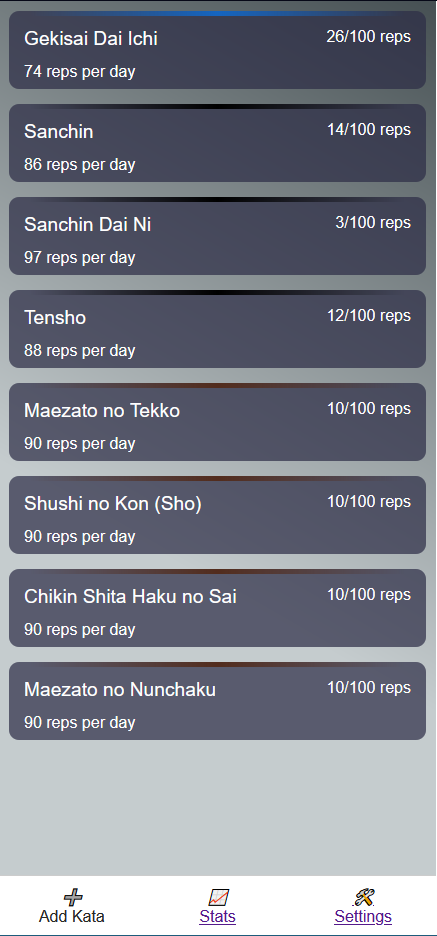

# kata-counter

A Cordova App for recording Karate Kata repetitions and goals. It displays how many reps you need to do per week/day to meet your goals.



## Other features

- Add/remove tags to Kata
- Filter Kata by tags
- Displays total reps for all kata (respects filters)
- Import/export JSON data
- Pick a colour
- Populate app with premade kata lists
- Uses local storage to record data (probably moving to proper on device storage eventually)
- Records the date/time of the last counter update 
- Global settings and per kata settings

## Todo

- Finish redesign
- Add graphs!
- Enable deletion of increments

## Development

```bash
# Or just use NPM it's fine
# Project setup
yarn install

# Compiles and hot-reloads for development
yarn serve

# Serve to an Android device for development (make sure to plug a phone in)
cordova-serve-android

# Compiles and minifies for production
yarn build

# Build Android APK (to install on Android, you need to sign the APK with Android Studio)
yarn cordova-build-android

# Lints and fixes files
yarn lint
```
